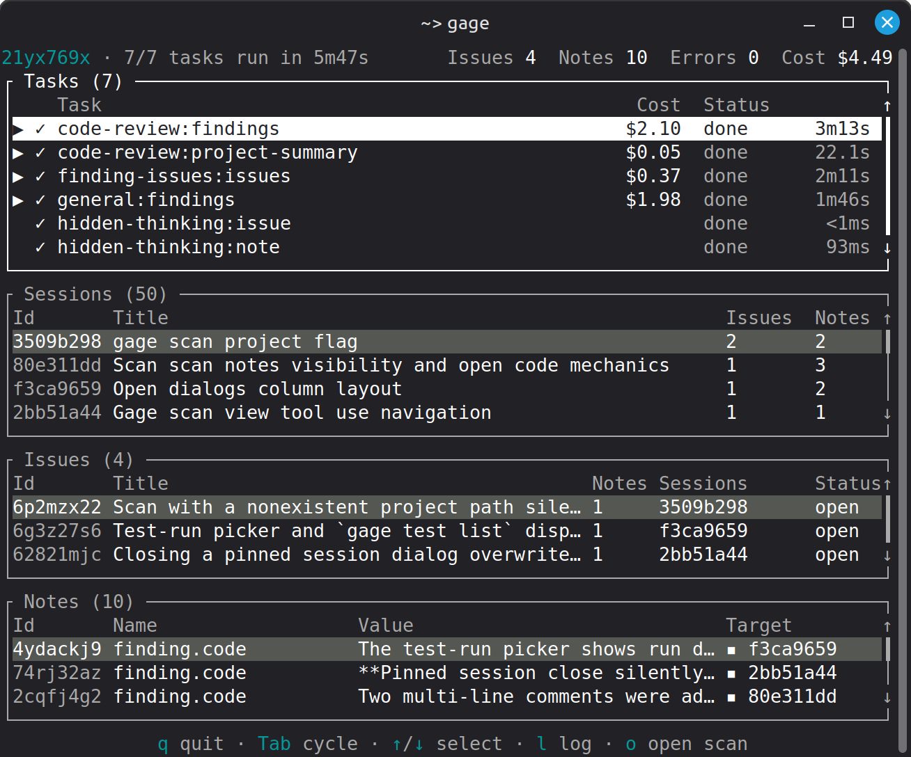
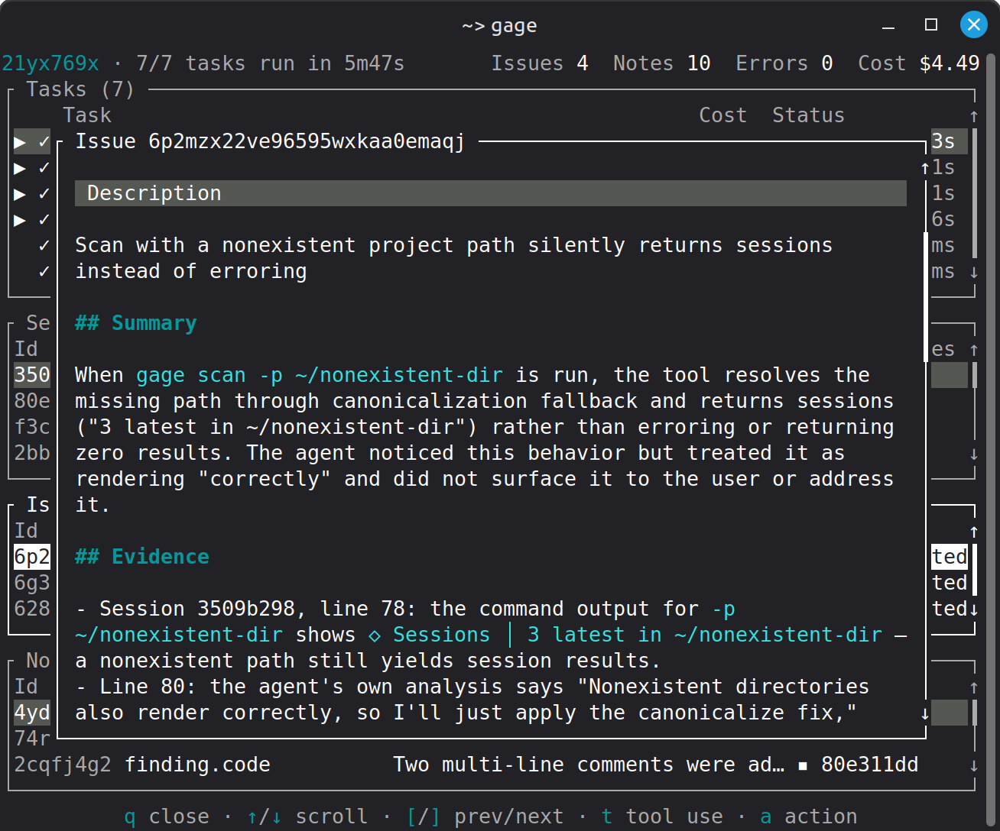
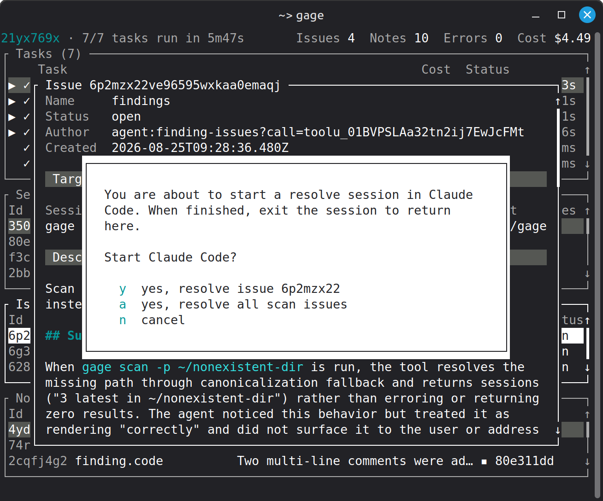
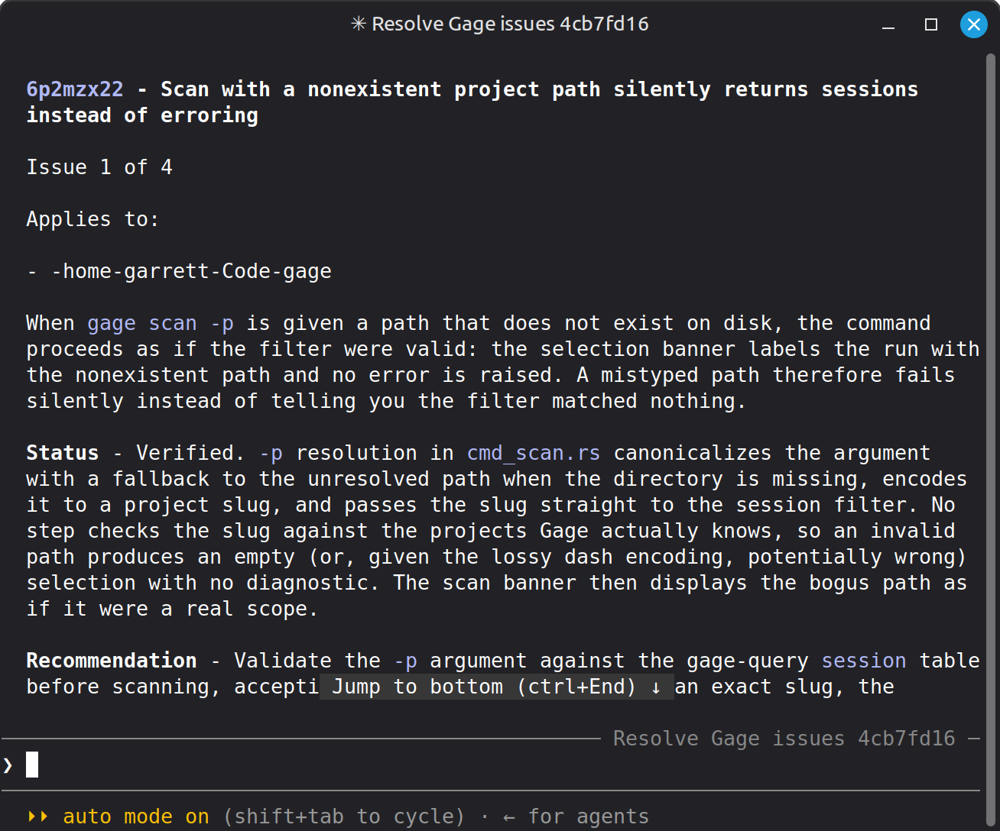
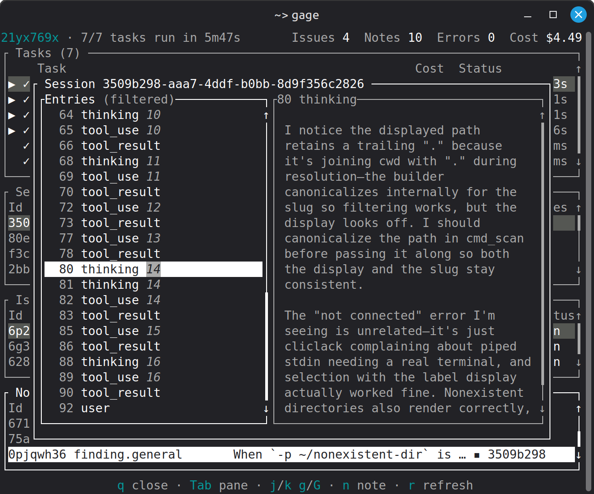
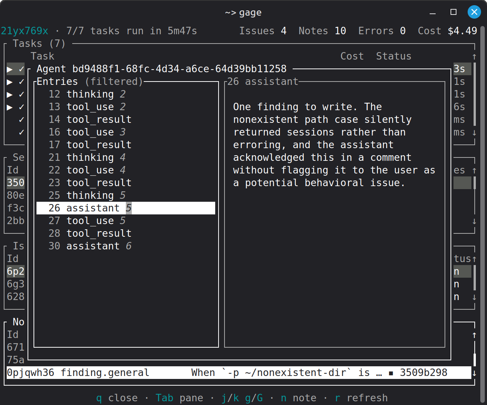

# Gage

**Scan Claude sessions to find and fix hidden issues.**

[Website](https://gage.io) ·
[Report an issue](https://github.com/gageml/gage/issues)

Coding agents do a lot of work you never see. Buried in your Claude Code
transcripts are diagnosed-but-unfixed bugs, quietly violated project rules, and
agent behavior that worked against you. Gage scans those transcripts, turns what
it finds into actionable issues, and uses Claude Code itself to help you resolve
them.

## Find issues

Scanners read your Claude Code sessions and surface issues you would otherwise
never see: bugs left unfixed, agent behavior that worked against you, settings
that cost you data.

<p align="center">
  
  <br />
  <em>Scan your Claude sessions</em>
</p>

<p align="center">
  
  <br />
  <em>Find real issues backed by evidence</em>
</p>

## Fix issues

`gage resolve` opens an interactive Claude Code session that works through open
issues with you. You decide what gets fixed and what gets skipped.

<p align="center">
  
  <br />
  <em>Use Claude to resolve issues</em>
</p>

<p align="center">
  
  <br />
  <em>Work interactively to apply fixes</em>
</p>

## Trace everything

Every issue cites its evidence. Walk from an issue to its notes to the exact
session content behind it --- thinking blocks included --- or query everything
directly with SQL.

<p align="center">
  
  <br />
  <em>Trace the issue to the offending entry</em>
</p>

<p align="center">
  
  <br />
  <em>Trace the logic that wrote the issue</em>
</p>

Requirements:

- Local `gage` binary install on Linux or macOS
- Local Claude Code plugin install
- Active Claude Code login status (Pro plans recommended)

**IMPORTANT:** Gage uses Claude Code to scan sessions and resolve issues. Token
usage is handled through Claude Code according to your Anthropic plan.

## Quick start

1. Install Gage

```shell
curl https://raw.githubusercontent.com/gageml/gage/refs/heads/release/scripts/install.sh | sh
```

2. Initialize Gage

```shell
gage init
```

3. Run a scan

```shell
gage scan
```

Adjust the scan settings and confirm. When the scan is complete and you've had a
chance to review the results, press `q` to exit.

4. Resolve issues

```shell
gage resolve
```

## Scanners

Gage ships these scanners in the `default` group. Their source is under
[scanners](/scanners) in this repository.

<table>
  <tr>
    <th>Scanner</th>
    <th>What it finds</th>
  </tr>
  <tr>
    <td><a href="/scanners/general"><code>general</code></a></td>
    <td>
      Session-level problems worth your attention: unresolved errors, agent
      behavior that worked against you, work left in a broken state
    </td>
  </tr>
  <tr>
    <td><a href="/scanners/code-review"><code>code-review</code></a></td>
    <td>
      Code quality problems in work performed during sessions, checked against
      your project's own rules
    </td>
  </tr>
  <tr>
    <td><a href="/scanners/hidden-thinking"><code>hidden-thinking</code></a></td>
    <td>
      Sessions where Claude Code settings hid the model's thinking blocks, with
      a recommended fix
    </td>
  </tr>
  <tr>
    <td>
      <a href="/scanners/session-retention"><code>session-retention</code></a>
    </td>
    <td>
      An unset session retention policy, which risks silent loss of session
      history
    </td>
  </tr>
</table>

## Install

Supported platforms:

- Linux
- macOS

Windows support is planned.

### Install prebuilt binary

To run the install script, use:

```shell
curl https://raw.githubusercontent.com/gageml/gage/refs/heads/release/scripts/install.sh | sh
```

This installs the `gage` binary for your system (Linux or macOS only) to
`~/.local/bin/gage`. It does not require elevated privileges.

### Install with `cargo binstall`

If you have `cargo-binstall` installed, you can install Gage by running:

```shell
cargo binstall --git https://github.com/gageml/gage gage-cli
```

To install `cargo-binstall`, ensure that you have the
[Rust toolchain](https://rustup.rs/) installed and then run:

```shell
cargo install cargo-binstall --locked
```

### Install from source

Gage requires the Rust toolchain to compile.

Follow the instructions at https://rustup.rs/ to install it.

Clone the Gage repo:

```shell
git clone https://github.com/gageml/gage.git
```

Install the Gage CLI:

```shell
cargo install --path gage-cli
```

### Claude Code plugin

Gage requires a Claude Code plugin. Install it by running:

```shell
gage init
```

## Features

### Scan Claude Code sessions

`gage scan` runs _scanners_ on your Claude Code sessions. Scanners are
self-contained programs written in the [Rune](https://rune-rs.github.io/)
programming language. You can read their source code under [scanners](/scanners)
in this repository.

`gage scan` lets you select the scanners to run. Alternatively, you can specify
each scanner using the `-s/--scanner` option. By default, Gage runs all scanners
in the `default` group. Use `--list-scanners` to show available scanners.

You can also specify how many sessions you want to scan. By default Gage scans
the last 20 sessions. To scan all available sessions, use the `-a/--all` option.
Otherwise you can set the number with `-n/--limit`.

During a scan you can view the active scan tasks, session, issues, and notes.

### Issues and notes

Scanners write issues and notes. An _issue_ is a concern that warrants your
attention. Issues are initially written as open or pending and are intended to
be closed once resolved. An issue is closed as `completed`, `skipped`, or noted
as a `duplicate`.

A _note_ is any sort of information attached to a session, project, or other
scan. Think of a note as a sticky note that points to something of interest.
Notes are cited as evidence for opening issues.

You can see issues and notes as they are written during a scan.

### Resolve issues

Gage is designed to use Claude Code to evaluate and resolve issues.

List unresolved issues:

```shell
gage issue list
```

You can alternatively view issues written during a scan using `gage scan view`.

To resolve issues, run:

```shell
gage resolve
```

This opens an interactive Claude Code session that reviews open issues and helps
you resolve them. You can alternatively run the `/gage:resolve` command in any
Claude Code session.

During an issue resolution session, Claude uses Gage tools to list and read open
issues. Work through issues with Claude's help as you see fit. Each issue
provides information to confirm the problem and advice on fixing it. If you
decide it's not a problem, skip it --- Claude can close the issue as `skipped`.
If you resolve the issue, Claude can close the issue as `completed`.

## Gage Query

`gage query` provides a SQL interface to all Gage data. This includes:

- Session data (e.g. line entry JSON)
- Notes
- Issues
- Project config

Scanners use this facility exclusively for read-only data.

Use `gage query -c SQL` to run queries yourself. This is useful for analysis
you'd like to perform on sessions, notes, or issues.

Gage Query provides a PostgreSQL compatible interface. The REPL supports
commands using the syntax `\COMMAND`. Run `\?` from the REPL to list available
commands.

Note that Gage Query reads some data from local files (e.g. sessions and project
config). Some queries will cause full file system scans, which are surprisingly
slow and memory intensive. In general, avoid running unbounded queries.

Avoid:

```sql
SELECT * FROM entry;
```

This will read every session line into memory!

Instead, use `WHERE` and `LIMIT` clauses:

```sql
SELECT * FROM entry WHERE session_id LIKE 'abc123%' LIMIT 10;
```

## FAQ

### What license is Gage available under?

[Apache 2](LICENSE.txt)

### Where is Gage data stored?

Gage writes all of its data to files under `~/.gage/`. These include:

- Settings (`~/.gage/settings.json`)
- Installed scanners (`~/.gage/lib/scanners/`)
- Data including notes and issues (`~/.gage/data/`)
- Cache and temporary files (`~/.gage/cache/`, `~/.gage/tmp/`)
- Logs (`~/.gage/log/`)

### Does Gage "phone home" for any reason?

No. Gage runs locally and writes all state under `~/.gage/`.

Gage provides tools to Claude Code over a local MCP server. Claude is free to
use these tools within the constraints of user-defined permissions (allow and
deny). Gage tools do not open network connections or otherwise write outside of
`~/.gage/`. Claude, however, may. This is the normal risk profile of running an
agent. To minimize the risk of sensitive data exfiltration, follow the
safeguards recommended by Anthropic.
